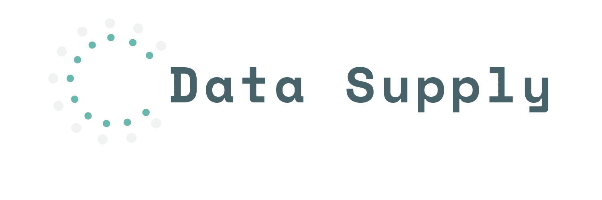

# DATA-SUPPLY  



DATA-SUPPLY是DATA-TALK的后端
+ 使用sqlite3，对数据进行存储
+ 使用Koa作为后端框架

## Installation
```
git clone https://github.com/HLGhpz/Data-Support-TS
pnpm install
pnpm start
```
## License
Data-Supply is MIT licensed.
